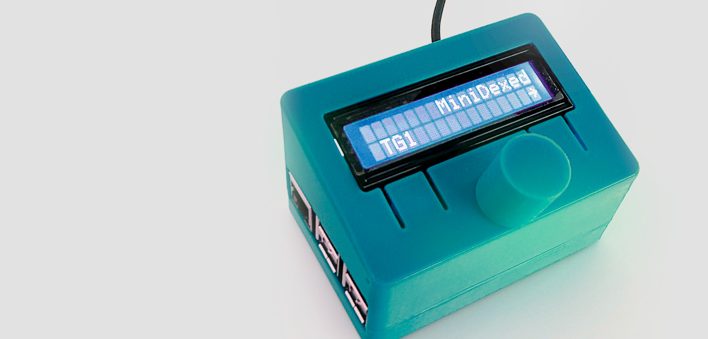
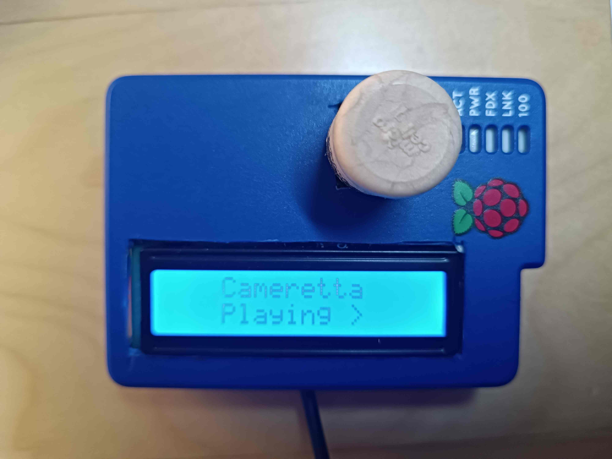
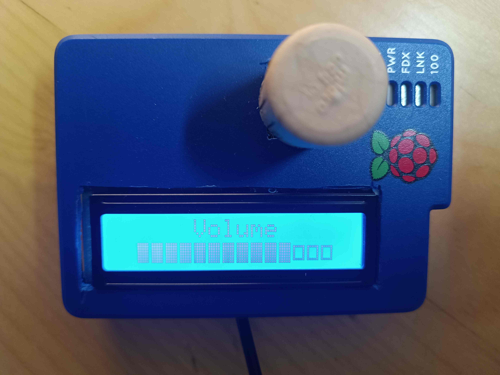

# Snapclient dashboard

Open-source [Home Assistant](https://www.home-assistant.io/) media speaker dashboard for Raspberry Pi.


## Description

**snapclient_dashboard** is a python app providing control to a [**Home Assistant media player**](https://www.home-assistant.io/integrations/media_player/) through physical controls (LCD screen, rotary encoder).

It is the perfect companion app for a [**snapcast**](https://github.com/badaix/snapcast)-powered Raspberry Pi client to create synchronized satellite players, which will then be controlled locally.

## Hardware
It is based on the same hardware designed for the [Minidexed](https://github.com/probonopd/MiniDexed) project (thanks for the inspiration!).

In the picture below, you can see an example of construction, enclosed (very professionally) into a 3d-printed custom case:


For further information and construction guide, please refer to [this page](https://github.com/probonopd/MiniDexed/wiki/Hardware)

## Features
- Integrated with Home Assistant through REST API
- Supporting LCD 16x2 screens, either "raw" or with i2c backpack
- Controlling Play/Pause, volume up-down/mute and source selection using a rotary encoder only
- Running on any Raspberry Pi model (40-pin GPIO required for audio DAC support)

## Images
Here a couple of pics of my first prototype build: 

Main view


Volume control


## Usage
- clone repository
- move into `snapclient_dashboard` directory, create and enable a virtualenv environment
```commandline
cd snapclient_dashboard
virtualenv venv
./venv/bin/activate
```
- install requirements
```commandline
pip install -r requirements/requirements.txt
```
- create `config.py` as a copy of `config_sample.py` and edit your parameters (LCD model, GPIO connections, Home Assistant URL, token, media player entity ID)
```commandline
cp config_sample.py config.py
nano config.py
```
- run app with
```commandline
./snapdash
```

## Test & development
Snapdash can be tested on any python-capable hardware (eg: PC), simulating LCD on screen, and using keyboard to control menu.
To do so:
- don't install / remove RPi.GPIO requirement (to allow internal stub lib)
```commandline
pip uninstall RPi.GPIO
```
- set `TEST_MODE = True` in `config.py`
- keyboard commands will then be:
```doctest
Left = A
Right = D
Button = Space
```

### Warning
In order to be run in production (headless), it is mandatory to set `TEST_MODE = False`